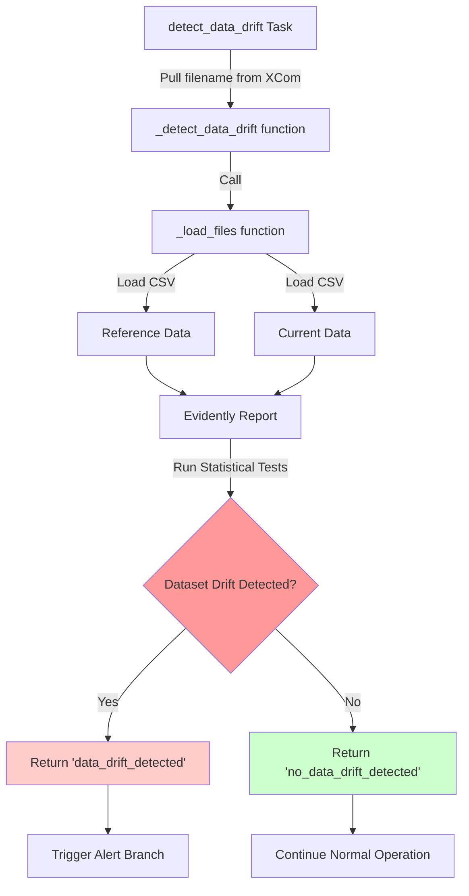
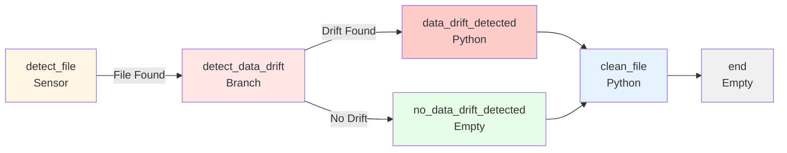

# 📊 Data Drift Monitoring with Apache Airflow & Evidently AI

> **Learning Project**: An automated data quality monitoring system that detects when your data starts behaving differently than expected.

---

## 🎯 The Big Picture: What Does This Do?

Imagine you have a weather prediction model that was trained on historical data. Over time, the patterns in your incoming data might change—maybe due to climate change, sensor upgrades, or seasonal variations. This change is called **data drift**, and it can silently break your ML models!

**This project solves that problem by:**
1. 🔍 **Automatically monitoring** new data files as they arrive
2. 📈 **Comparing** new data against a "reference" baseline to detect unusual changes
3. 🚨 **Alerting** you when drift is detected via cloud dashboards
4. 🧹 **Cleaning up** processed files to keep your system organized

**Real-world use case**: A data science team receives weekly weather data and needs to ensure it matches expected patterns before retraining their forecasting models. This system runs automatically every day at 4 PM, checking for issues without manual intervention.

---

## 🛠️ The Tech Stack: Why Each Tool?

| Technology | Version | Purpose & Why It's Used |
|------------|---------|------------------------|
| **Python 3.12** | Latest | The backbone language—chosen for its rich data science ecosystem |
| **Apache Airflow 3.1.3** | Latest | *Workflow orchestration engine*—schedules and manages our monitoring pipeline. Think of it as a smart cron job on steroids that handles dependencies, retries, and monitoring |
| **Evidently AI 0.7.17** | Latest | *ML monitoring library*—performs statistical tests to detect data drift. It's like a health check for your datasets, running tests like Kolmogorov-Smirnov for numerical features |
| **PostgreSQL 16** | Latest | *Metadata database*—Airflow uses this to track task states, execution history, and workflow metadata |
| **Redis 7.2** | Stable | *Message broker*—enables distributed task execution across multiple workers in Celery |
| **Docker & Docker Compose** | - | *Containerization*—ensures everyone runs the exact same environment, eliminating "works on my machine" issues |
| **Pandas** | via Evidently | *Data manipulation*—loads and transforms CSV files for analysis |

**Architecture Choice**: We use **CeleryExecutor** (not LocalExecutor) because it allows horizontal scaling—you can add more workers to handle increased load.

---

## 📂 Project Architecture

```
sample-evidently-dag/
│
├── 📁 dags/                          # Airflow DAG definitions (your workflow logic)
│   └── monitoring-dag.py             # ⭐ THE MAIN FILE - defines the drift monitoring workflow
│
├── 📁 data/                          # Data storage (mounted into Docker containers)
│   ├── reference/                    # Baseline "good" data for comparison
│   │   └── weather-reference-sample.csv
│   └── data-drift/                   # Incoming data files to monitor
│       ├── week1.csv                 # Simulated weekly data drops
│       ├── week2.csv
│       └── week3.csv
│
├── 📁 logs/                          # Airflow execution logs (auto-generated)
│   └── (task logs appear here after runs)
│
├── 📁 plugins/                       # Custom Airflow plugins (currently empty)
│   └── (extend Airflow functionality here)
│
├── 📁 config/                        # Airflow configuration files
│   └── airflow.cfg                   # (auto-generated by docker-compose)
│
├── 🐳 docker-compose.yaml            # Multi-container orchestration (8 services!)
│   # Defines: postgres, redis, scheduler, worker, api-server, dag-processor, triggerer, init
│
├── 🐳 Dockerfile                     # Custom Airflow image with Evidently installed
│
├── 📦 requirements.txt               # Python dependencies (just Evidently for now)
│
├── 🙈 .gitignore                     # Ignores logs and temporary files
│
└── 📖 README.md                      # You are here! 👋
```

### 🔍 Key Folders Explained

- **`/dags`**: The heart of your project. Each Python file here defines a workflow (DAG = Directed Acyclic Graph). Our `monitoring-dag.py` is the only DAG and contains all the monitoring logic.

- **`/data/reference`**: Contains "baseline" data representing normal/expected distributions. All new data is compared against this reference.

- **`/data/data-drift`**: Drop new CSV files here to trigger the monitoring workflow. The system watches this folder and processes files matching `week*.csv`.

- **`/logs`**: Airflow automatically writes detailed logs here. Check these first when debugging!

- **Docker Compose Services** (8 containers working together):
  - `postgres` - Stores Airflow's metadata
  - `redis` - Message queue for task distribution
  - `airflow-apiserver` - Web UI (access at `localhost:8080`)
  - `airflow-scheduler` - Decides when to run tasks
  - `airflow-dag-processor` - Parses DAG files
  - `airflow-worker` - Executes tasks
  - `airflow-triggerer` - Handles async event-based tasks
  - `airflow-init` - One-time setup (creates admin user, folders, etc.)

---

## 🔄 The Code Walkthrough: 3 Critical Flows

### **Flow 1: File Detection (The Trigger)**

**What happens**: The system continuously checks for new data files.

**Journey through the code**:

1. **Start**: `PythonSensor` task (`detect_file`) runs every 30 seconds
2. **Function**: `_detect_file()` in `monitoring-dag.py` (lines 123-171)
   ```python
   glob.glob("/opt/airflow/data/data-drift/week*.csv")
   ```
3. **Logic**:
   - If no files → Returns `False` → Sensor keeps waiting
   - If file found → Selects newest (by creation time) → Pushes filename to **XCom** (Airflow's inter-task messaging) → Returns `True`
4. **Result**: DAG continues to next task

**Key Learning**: Sensors are different from operators! They **poll** until a condition is met, blocking the workflow until success.

---

### **Flow 2: Drift Detection (The Analysis)**

**What happens**: New data is loaded, compared to reference data, and analyzed for drift.

**Journey through the code**:



**Step-by-step breakdown**:

1. **Pull Data** (`_detect_data_drift`, line 183):
   ```python
   data_logs_filename = ti.xcom_pull(task_ids="detect_file", key="data_logs_filename")
   ```
   ⚠️ **Airflow 3.x Note**: Must specify `task_ids` parameter (changed from 2.x!)

2. **Load Data** (`_load_files`, line 78):
   - Loads reference CSV from `/data/reference/`
   - Loads current CSV (the file we just detected)
   - Converts datetime columns
   - Drops unnecessary columns (`count`)
   - Returns as Evidently `Dataset` objects

3. **Create Report** (line 206):
   ```python
   data_drift_run = Report([DataDriftPreset()])
   ```
   - `DataDriftPreset()` includes multiple statistical tests:
     - **Kolmogorov-Smirnov test** for numerical features (temp, humidity, windspeed)
     - **Chi-square test** for categorical features (season, holiday, workingday)
     - **Dataset-level summary** (overall drift score)

4. **Run Analysis** (line 215):
   ```python
   data_drift_result = data_drift_run.run(
       current_data=data_logs, 
       reference_data=reference
   )
   ```

5. **Check Results** (line 226):
   ```python
   if report["metrics"][0]["value"]["count"] > 0:
       return "data_drift_detected"  # Branch to alert task
   else:
       return "no_data_drift_detected"  # Branch to no-op task
   ```

**Key Learning**: This uses a **BranchPythonOperator**—the return value determines which downstream task(s) execute. It's Airflow's way of implementing `if/else` logic in workflows!

---

### **Flow 3: Cloud Reporting (The Alert)**

**What happens**: If drift is detected, a detailed report is generated and uploaded to Evidently Cloud.

**Journey through the code**:

1. **Task Execution** (`data_drift_detected` task, line 377):
   - Only runs if the branch operator returned `"data_drift_detected"`

2. **Credential Check** (`_data_drift_detected`, line 255):
   ```python
   if not EVIDENTLY_CLOUD_TOKEN or not EVIDENTLY_CLOUD_PROJECT_ID:
       raise ValueError("Credentials not configured!")
   ```
   - These come from **Airflow Variables** (set in Admin > Variables in UI)

3. **Connect to Cloud** (line 263):
   ```python
   ws = CloudWorkspace(token=EVIDENTLY_CLOUD_TOKEN, url="https://app.evidently.cloud")
   project = ws.get_project(EVIDENTLY_CLOUD_PROJECT_ID)
   ```

4. **Generate & Upload Report** (lines 280-297):
   ```python
   data_drift_report = Report([DataDriftPreset()])
   data_drift_result = data_drift_report.run(current_data=data_logs, reference_data=reference)
   ws.add_run(project_id=project.id, run=data_drift_result, include_data=True)
   ```
   - `include_data=True` uploads raw data for deep analysis in the cloud UI

5. **Cleanup** (`clean_file` task, line 320):
   - Removes the processed CSV file (optional, controlled by task dependencies)

**Full Workflow Visualization**:



**Key Learning**: Notice the **trigger rules**! The `clean_file` task has `trigger_rule="none_failed_min_one_success"` (line 407), meaning it runs after *either* branch completes successfully. Without this, it would only run after *both* branches (which never happens with branching).

---

## 💡 Key Learning Moments: Study These Closely!

### 1. **XCom Communication (Airflow 3.x Changes)** 📬

**File**: `monitoring-dag.py`, lines 156 & 188

**What to learn**: Airflow 3.x changed how tasks share data!

```python
# ❌ OLD WAY (Airflow 2.x) - No longer works!
data_logs_filename = context["task_instance"].xcom_pull(key="data_logs_filename")

# ✅ NEW WAY (Airflow 3.x) - Must specify source task
data_logs_filename = context["task_instance"].xcom_pull(
    task_ids="detect_file",  # Which task pushed this value?
    key="data_logs_filename"
)
```

**Why it matters**: This makes data lineage explicit—you can trace where each value came from, improving debugging and clarity.

---

### 2. **The Sensor Pattern** 🔍

**File**: `monitoring-dag.py`, lines 123-171

**What to learn**: How to implement **event-driven workflows** instead of rigid schedules.

```python
detect_file = PythonSensor(
    task_id="detect_file",
    python_callable=_detect_file,
    poke_interval=30,  # Check every 30 seconds
    timeout=600,       # Give up after 10 minutes
    mode="poke"        # Block a worker while waiting
)
```

**Design Pattern**: The sensor keeps calling `_detect_file()` until it returns `True`. This is more efficient than running the entire DAG every 30 seconds hoping a file exists!

**Alternative modes**:
- `poke` (current): Blocks a worker slot but responds instantly when condition is met
- `reschedule`: Frees up the worker between checks but adds slight delay

---

### 3. **Defensive Programming & Error Handling** 🛡️

**File**: `monitoring-dag.py`, lines 196-200 & 255-260

**What to learn**: Always validate external inputs!

```python
# After pulling from XCom
if not data_logs_filename:
    raise ValueError(
        "No data file found! The detect_file sensor should have pushed a filename to XCom. "
        "Check that the sensor task completed successfully and pushed the value."
    )

# Before using API credentials
if not EVIDENTLY_CLOUD_TOKEN or not EVIDENTLY_CLOUD_PROJECT_ID:
    raise ValueError(
        "Evidently Cloud credentials not configured! "
        "Please set EVIDENTLY_CLOUD_TOKEN and EVIDENTLY_CLOUD_PROJECT_ID "
        "in Airflow Variables (Admin > Variables)"
    )
```

**Why this matters**: These checks provide **actionable error messages** instead of cryptic stack traces. When a student (or your future self!) encounters an error, the message explains exactly what to fix.

**Bonus**: Notice how the code uses `print()` statements throughout (lines 147, 158, 194, etc.) for observability—these appear in Airflow logs and help debug production issues.

---

## 🚀 Setup & Run: Get Started in 10 Minutes

### Prerequisites

Make sure you have installed:
- 🐳 **Docker Desktop** (or Docker Engine + Docker Compose)
- 💻 At least **4GB RAM** and **10GB disk space** available
- 🌐 **Internet connection** (to download images)

### Step 1: Clone & Navigate

```bash
# Navigate to the project directory
cd sample-evidently-dag

# Verify files are present
ls -la
# You should see: docker-compose.yaml, Dockerfile, dags/, data/, etc.
```

### Step 2: Build the Custom Airflow Image

```bash
# Build the image with Evidently installed
docker-compose build

# This takes 3-5 minutes on first run
# It downloads the base Airflow image and installs evidently==0.7.17
```

### Step 3: Initialize Airflow

```bash
# Create necessary folders and initialize the database
docker-compose up airflow-init

# Wait for the message: "airflow-init_1 exited with code 0"
```

### Step 4: Start All Services

```bash
# Start the entire Airflow cluster (8 containers)
docker-compose up -d

# Check that all services are running
docker-compose ps

# Wait 1-2 minutes for all health checks to pass
```

### Step 5: Access the Airflow UI

1. Open your browser: **http://localhost:8080**
2. Login with default credentials:
   - **Username**: `airflow`
   - **Password**: `airflow`

3. You should see the **`monitoring_dag`** in the DAGs list!

### Step 6: Configure Evidently Cloud (Optional but Recommended)

To see drift reports in the cloud:

1. **Sign up** for Evidently Cloud: https://app.evidently.cloud
2. **Create a project** and copy your:
   - API Token
   - Project ID

3. In Airflow UI, go to **Admin > Variables**
4. Add two new variables:
   - Key: `EVIDENTLY_CLOUD_TOKEN`, Value: `<your_token>`
   - Key: `EVIDENTLY_CLOUD_PROJECT_ID`, Value: `<your_project_id>`

### Step 7: Trigger the DAG

**Option A: Manual Trigger (Recommended for Learning)**

1. In the Airflow UI, click on `monitoring_dag`
2. Toggle the DAG **ON** (switch in top-left)
3. Click the **▶️ Play button** (top-right) to trigger manually

**Option B: Automatic Schedule**

- The DAG runs automatically **daily at 4:00 PM** (cron: `0 16 * * *`)
- The sensor will wait until a file matching `week*.csv` appears in `/data/data-drift/`

### Step 8: Watch It Run! 🎬

1. **Graph View**: See the workflow structure
   - Click the DAG name → "Graph" tab
   - Watch tasks turn from white → yellow (running) → green (success) or red (failed)

2. **Task Logs**: Debug and learn
   - Click any task box → "Log" button
   - Read the `print()` statements we added for learning!

3. **Monitor Progress**:
   - `detect_file` sensor will wait for a file (check every 30 seconds)
   - `detect_data_drift` analyzes the data
   - Branch splits based on drift detection
   - `clean_file` removes the processed file

### Step 9: Test with Sample Data

```bash
# The project comes with test files already!
# Verify they exist:
ls -la data/data-drift/
# You should see: week1.csv, week2.csv, week3.csv

# If the DAG is running and watching, it will process these files
# To reprocess them, just copy them back:
cp data/data-drift/week1.csv data/data-drift/week_test.csv

# The sensor will detect week_test.csv and trigger the workflow!
```

### Step 10: Clean Up (When Done)

```bash
# Stop all containers
docker-compose down

# Remove volumes (this deletes all Airflow data—use with caution!)
docker-compose down -v
```

---

## 🐛 Troubleshooting

### "DAG not showing up in UI"

**Solution**: DAGs are parsed every 30 seconds. Wait a minute, or check for Python syntax errors:

```bash
docker-compose exec airflow-dag-processor airflow dags list
```

### "Task failed: No module named 'evidently'"

**Solution**: The custom image wasn't built. Run:

```bash
docker-compose build --no-cache
docker-compose up -d --force-recreate
```

### "ValueError: Invalid file path or buffer object type: NoneType"

**Solution**: The XCom value wasn't found. Check:
1. Did the `detect_file` sensor complete successfully?
2. Are there files matching `week*.csv` in `/data/data-drift/`?
3. Check sensor logs for XCom push confirmation

### "Evidently Cloud credentials not configured"

**Solution**: Add variables in Airflow UI (Admin > Variables):
- `EVIDENTLY_CLOUD_TOKEN`
- `EVIDENTLY_CLOUD_PROJECT_ID`

Or comment out the cloud upload task if testing locally.

---

## 📚 Next Steps: Level Up Your Learning

Once you're comfortable with this project:

1. **Modify the Schedule**: Change line 328 from `"0 16 * * *"` to run more frequently
2. **Add More Data**: Create `week4.csv`, `week5.csv` with different distributions
3. **Add Email Alerts**: Use Airflow's `EmailOperator` to send notifications when drift is detected
4. **Custom Drift Metrics**: Replace `DataDriftPreset()` with specific metrics from Evidently
5. **Database Integration**: Instead of CSV files, read from a PostgreSQL or MongoDB database
6. **Add Tests**: Create unit tests for the `_load_files()` and `_detect_data_drift()` functions

---

## 🙏 Credits & Further Reading

- **Apache Airflow Docs**: https://airflow.apache.org/docs/
- **Evidently AI Docs**: https://docs.evidentlyai.com/
- **Airflow 3.x Migration Guide**: https://airflow.apache.org/docs/apache-airflow/stable/migration-guide-3.0.html
- **Data Drift Explained**: https://www.evidentlyai.com/blog/ml-monitoring-data-drift

---

## 🎓 Learning Outcomes

After completing this project, you should understand:

- ✅ How to build **production-grade data pipelines** with Airflow
- ✅ The importance of **data quality monitoring** in ML systems
- ✅ How **sensors** enable event-driven workflows
- ✅ Using **branching** for conditional logic in DAGs
- ✅ **XCom** for inter-task communication
- ✅ **Docker Compose** for multi-service orchestration
- ✅ Statistical tests for **drift detection** (KS test, Chi-square)
- ✅ **Defensive programming** with validation and error handling

---

**Happy Learning! 🚀 Questions? Check the code comments—they're there to help you!**

